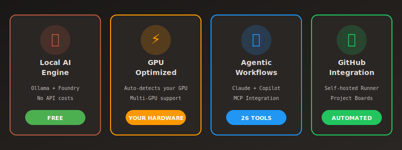
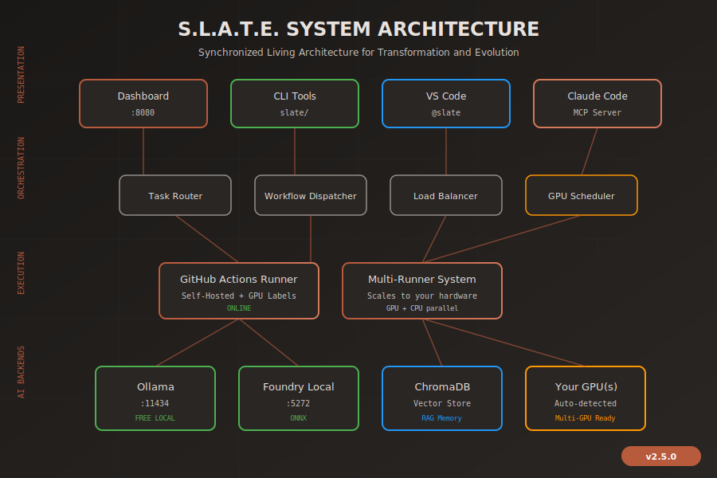

<!-- SEO: Local AI Development Environment | GitHub Actions AI Integration | Self-Hosted AI Runner | Free Local LLM | VS Code AI Automation -->
<!-- Keywords: local ai, github actions, self-hosted runner, ollama, ai automation, devops ai, free ai development, local llm, ai workflow -->

# Turn Your Local Hardware Into an AI Operations Center for GitHub

**Stop paying for cloud AI. Stop sending your code to external servers. Run AI operations locally and integrate seamlessly with GitHub.**

<p align="center">
  
</p>

<h1 align="center">S.L.A.T.E.</h1>
<!-- Modified: 2026-02-07T14:00:00Z | Author: CLAUDE | Change: Embed themed diagrams and visual identity -->

<p align="center">
  <strong>Synchronized Living Architecture for Transformation and Evolution</strong>
</p>

<p align="center">
  <a href="LICENSE"></a>
  <a href="LICENSE"></a>
  <a href="LICENSE"></a>
  <a href="https://www.python.org/downloads/"></a>
  <a href="https://pytorch.org/"></a>
  <a href="https://github.com/SynchronizedLivingArchitecture/S.L.A.T.E/actions"></a>
  <a href="https://github.com/SynchronizedLivingArchitecture/S.L.A.T.E/wiki"></a>
</p>

<p align="center">
  <strong>Local AI compute + Cloud collaboration = Full control</strong>
</p>

<p align="center">
  Works with GitHub Copilot, VS Code, Claude Code, AI Toolkit, and PyTorch
</p>

---

> ⚠️ **WARNING: AI HOBBYIST PROJECT — EXPERIMENTAL SOFTWARE**
>
> This project is **entirely created and managed by AI** (GitHub Copilot, Claude Code) through **vibe coding**. It is an AI hobbyist experiment with a production-ready aim — but it is **not production-ready**. Not yet suitable for critical systems. Use at your own risk.
>
> **Quick Install**:
> ```bash
> git clone https://github.com/SynchronizedLivingArchitecture/S.L.A.T.E.git && cd S.L.A.T.E && python install_slate.py
> ```

---

## Why SLATE?

GitHub Actions is powerful. But every workflow runs on GitHub's infrastructure or requires you to manage runners manually. If you want AI in your pipeline, you're paying per-token to cloud providers. Your code gets sent to external servers. You're rate-limited. And when something breaks at 2am, you're debugging someone else's infrastructure.

**What if your local machine could be the brain behind your GitHub operations?**

SLATE creates an AI operations layer on your local hardware that connects directly to your GitHub ecosystem. It doesn't replace GitHub - it **extends it** with local AI compute.

### What You Get

<div align="center">



</div>

- **Local AI Engine** - Ollama + Foundry running on your GPU. Handles automation, code analysis, and task routing locally. No API bills. Ever.
- **Persistent Memory** - ChromaDB stores context about your codebase. Your AI ops get smarter over time.
- **Live Dashboard** - Monitor your local AI services, task queues, and GPU utilization in real-time.
- **GitHub Bridge** - Self-hosted runner connects your local AI ops directly to GitHub Actions, Issues, and PRs.

### System Requirements

| Component | Minimum | Recommended |
|-----------|---------|-------------|
| **OS** | Windows 10/11, Linux, macOS | Windows 11, Ubuntu 22.04+ |
| **Python** | 3.11+ | 3.11+ |
| **RAM** | 8GB | 16GB+ |
| **GPU** | None (CPU-only mode) | NVIDIA RTX 20xx+ with 8GB VRAM |
| **Storage** | 10GB free | 50GB+ SSD |
| **CUDA** | N/A for CPU | 12.x for GPU acceleration |

SLATE works without a GPU using CPU-only inference, but GPU acceleration significantly improves performance.

### How It Works

Your local hardware runs the AI. Your cloud stays in sync. SLATE monitors GitHub, processes tasks locally, and pushes results back. Automated code review, task execution, workflow management - all orchestrated from your machine.

**The Philosophy:** Cloud services are great for collaboration. GitHub is where your code lives, where your team works, where your community engages. That shouldn't change. But compute? AI inference? Automation logic? That can run on the hardware sitting under your desk. Your electricity. Your GPU cycles. Your control.

---

## Table of Contents

- [Overview](#overview)
  - [The Fork Feedback Loop](#the-fork-feedback-loop)
  - [The /slate Agent](#the-slate-agent)
- [GitHub Integration Deep Dive](#github-integration-deep-dive)
  - [Self-Hosted Runner with AI Capabilities](#self-hosted-runner-with-ai-capabilities)
  - [Bidirectional Task Sync](#bidirectional-task-sync)
  - [Project Board Automation](#project-board-automation)
  - [Discussion Integration](#discussion-integration)
  - [Workflow Architecture](#workflow-architecture)
  - [The AI Orchestrator](#the-ai-orchestrator)
  - [What This Means Practically](#what-this-means-practically)
- [System Architecture](#system-architecture)
- [Key Features](#key-features)
- [Quick Start](#quick-start)
- [Copilot Integration](#copilot-integration)
- [GitHub Project Boards](#github-project-boards)
- [Multi-Runner System](#multi-runner-system)
- [Docker & Kubernetes Deployment](#docker--kubernetes-deployment)
- [Local AI Providers](#local-ai-providers)
- [CLI Reference](#cli-reference)
- [Security](#security)
- [Built-In Safeguards](#built-in-safeguards)
- [Contributing](#contributing)
- [License](#license)

## Overview

SLATE is a local-first AI orchestration system that:

- **Runs entirely on your machine** - No cloud dependencies, no data leaves localhost
- **Coordinates multiple AI models** - Ollama, Foundry Local, and API-based models
- **Optimizes for your hardware** - Auto-detects GPUs and configures optimal settings
- **Manages complex workflows** - GitHub Projects, multi-runner execution, parallel processing
- **Integrates with your AI tools** - GitHub Copilot, VS Code, AI Toolkit, and PyTorch

### The Fork Feedback Loop

When you install SLATE, you're encouraged to **fork the repository** rather than just clone it. This creates a powerful feedback loop:

```
SLATE (main repo)  ←→  Your Fork (your workspace)
       ↑                      ↓
       └──── Improvements ←───┘
```

Your fork becomes a personalized AI workspace that:
- Stays in sync with SLATE updates
- Adapts to your development patterns
- Contributes improvements back to the ecosystem
- Runs a self-hosted GitHub Runner for task execution

### The /slate Agent

SLATE comes with a custom `/slate` agent for VS Code and Claude Code:

| Command | Description |
|---------|-------------|
| `/slate start` | Start all SLATE services |
| `/slate status` | Check system and GPU status |
| `/slate-workflow` | Manage task queue |
| `/slate-runner` | Control GitHub Actions runner |
| `/slate-multirunner` | Manage multi-runner system |
| `/slate-gpu` | Manage dual-GPU load balancing |
| `/slate-discussions` | Manage GitHub Discussions |
| `/slate-claude` | Validate Claude Code integration |
| `/slate-spec-kit` | Process specs, run AI analysis, generate wiki |
| `/slate-help` | Show all available commands |

These commands orchestrate your local AI infrastructure directly from your editor.

### Claude Code Integration

SLATE provides full integration with Claude Code via MCP server and slash commands:

```json
{
  "mcpServers": {
    "slate": {
      "command": "<workspace>\\.venv\\Scripts\\python.exe",
      "args": ["<workspace>\\slate\\mcp_server.py"]
    }
  }
}
```

**MCP Tools Available:**
- `slate_status` - Check all services and GPU status
- `slate_workflow` - Manage task queue
- `slate_orchestrator` - Start/stop services
- `slate_runner` - Manage GitHub runner
- `slate_ai` - Execute AI tasks via local LLMs
- `slate_gpu` - Manage dual-GPU load balancing
- `slate_claude_code` - Validate Claude Code configuration
- `slate_spec_kit` - Process specs, run AI analysis, generate wiki

## GitHub Integration Deep Dive

This is where SLATE gets interesting. It's not just running models locally - it's creating a bridge between your hardware and GitHub's cloud infrastructure.

### Self-Hosted Runner with AI Capabilities

SLATE auto-configures a GitHub Actions runner on your machine. But unlike a basic runner, this one has access to local LLMs. Your workflows can call AI without hitting external APIs.

The runner auto-detects your GPU configuration and creates appropriate labels. If you have CUDA, it knows. If you have multiple GPUs, it knows. Workflows can target your specific hardware capabilities.

When a workflow triggers, it runs on YOUR machine with YOUR local AI. Code analysis, test generation, documentation updates - all processed locally and pushed back to GitHub.

### Bidirectional Task Sync

SLATE maintains a local task queue that syncs with GitHub Projects. Here's how it flows:

```
GitHub Issues created → SLATE pulls to local queue → Local AI processes → Results pushed as commits/PR comments
```

You can also go the other direction. Create a task locally, and SLATE can create the corresponding GitHub Issue automatically. The KANBAN board in GitHub Projects becomes your source of truth, but execution happens locally.

### Project Board Automation

SLATE maps to GitHub Projects V2:

| Board | Purpose | Auto-Route Keywords |
|-------|---------|---------------------|
| **KANBAN** | Active work queue | Default for pending tasks |
| **BUG TRACKING** | Bug fixes | bug, fix, crash, error |
| **ITERATIVE DEV** | Pull requests | PRs auto-added |
| **ROADMAP** | Completed features | feat, add, implement |
| **PLANNING** | Design work | plan, design, architect |

Tasks automatically route to the right board based on keywords. Bug reports go to bug tracking. Feature requests go to roadmap. Active work goes to KANBAN. No manual sorting required.

### Discussion Integration

GitHub Discussions feed into the system too. Ideas from the community get tracked. Q&A response times get monitored. Actionable discussions become tasks automatically. Your community engagement becomes part of your development pipeline.

### Workflow Architecture

SLATE includes several pre-built workflows:

| Workflow | Trigger | Purpose |
|----------|---------|---------|
| **CI Pipeline** | Push/PR | Linting, tests, security checks. Uses local AI for code review suggestions. |
| **Nightly Jobs** | Daily 4am | Full test suite, dependency audits, codebase analysis on your hardware. |
| **AI Maintenance** | Every 4h | Analyzes changed files. Daily full codebase analysis. Auto-updates docs. |
| **Fork Validation** | Fork PRs | Security gates, SDK verification, malicious code scanning. |
| **Project Automation** | Every 30min | Syncs Issues/PRs to boards. Keeps everything organized. |

The workflow manager enforces rules automatically:
- Tasks in-progress > 4 hours → flagged as stale
- Pending tasks > 24 hours → reviewed
- Duplicates → archived
- Max concurrent tasks → enforced

### The AI Orchestrator

This is the autonomous piece. SLATE includes an AI orchestrator that runs maintenance tasks on schedule:

| Task | Schedule | Description |
|------|----------|-------------|
| Quick analysis | Every 4 hours | Analyze recently changed files |
| Full analysis | Daily 2am | Complete codebase analysis |
| Documentation | Daily | Auto-generate/update docs |
| GitHub monitor | Daily | Workflow and integration analysis |
| Model training | Weekly Sunday | Train custom model on your codebase |

The orchestrator uses local Ollama models. It learns your codebase over time. It can even train a custom model tuned specifically to your project's patterns and architecture.

### What This Means Practically

**You push code.** SLATE's local AI analyzes it. Suggestions appear as PR comments. Tests get generated. Documentation updates. All without a single API call to OpenAI or Anthropic.

**Someone opens an issue.** It syncs to your local queue. AI triages it, adds labels, routes it to the right project board. You see it on your dashboard.

**A community member posts an idea in Discussions.** SLATE creates a tracking issue. Routes it to your roadmap board. You never miss actionable feedback.

**Your nightly workflow runs at 4am.** Full test suite on your hardware. Dependency audit. Security scan. Results waiting in your inbox when you wake up.

---

## System Architecture

<div align="center">



</div>

### Architecture Layers

| Layer | Components | Purpose |
|:------|:-----------|:--------|
| **Presentation** | Dashboard `:8080`, CLI, VS Code, Claude Code | User interfaces |
| **Orchestration** | Task Router, Workflow Dispatcher, Load Balancer | Coordination |
| **Execution** | GitHub Actions Runner, Multi-Runner System | GPU-enabled execution |
| **AI Backends** | Ollama `:11434`, Foundry Local `:5272` | FREE local inference |
| **Infrastructure** | ChromaDB, GPU Scheduler, LLM Cache | Core services |

### Component Map

```
┌──────────────────────────────────────────────────────────────────────────┐
│                         SLATE Module Architecture                         │
├──────────────────────────────────────────────────────────────────────────┤
│                                                                           │
│  slate/                                                                   │
│  ├── Orchestration                                                        │
│  │   ├── slate_orchestrator.py      # Service lifecycle management        │
│  │   ├── slate_project_board.py     # GitHub Projects V2 sync             │
│  │   ├── slate_workflow_manager.py  # Task lifecycle & cleanup            │
│  │   └── slate_workflow_analyzer.py # Meta-workflow self-management       │
│  │                                                                        │
│  ├── Execution                                                            │
│  │   ├── slate_multi_runner.py      # Parallel runner coordination         │
│  │   ├── slate_runner_manager.py    # GitHub Actions runner setup         │
│  │   ├── slate_runner_benchmark.py  # Resource capacity benchmarking      │
│  │   └── runner_fallback.py         # Cost-aware runner selection         │
│  │                                                                        │
│  ├── AI Backends                                                          │
│  │   ├── unified_ai_backend.py      # Central routing (FREE local first)  │
│  │   ├── foundry_local.py           # Ollama + Foundry client             │
│  │   └── ollama_client.py           # Direct Ollama integration           │
│  │                                                                        │
│  ├── System                                                               │
│  │   ├── slate_status.py            # Quick system health check           │
│  │   ├── slate_runtime.py           # Integration verification            │
│  │   ├── slate_hardware_optimizer.py# GPU detection & PyTorch setup       │
│  │   └── slate_benchmark.py         # Performance testing                 │
│  │                                                                        │
│  └── Security                                                             │
│      ├── action_guard.py            # API blocking & action validation    │
│      ├── sdk_source_guard.py        # Package publisher verification      │
│      └── pii_scanner.py             # PII detection for public boards     │
│                                                                           │
└──────────────────────────────────────────────────────────────────────────┘
```

## Key Features

### Local-First Design
- All services bind to `127.0.0.1` only
- No telemetry or external data collection
- Your code and prompts stay on your machine
- FREE local AI inference (no cloud costs)

### GitHub Projects Integration
- **KANBAN** (Project 5): Primary workflow source
- **BUG TRACKING** (Project 7): Auto-routed bug fixes
- **ITERATIVE DEV** (Project 8): PR tracking
- **ROADMAP** (Project 10): Completed features
- Scheduled sync every 30 minutes

### Multi-Runner Execution
- **Scales to your hardware** - auto-detects GPUs and CPU cores
- GPU runners for inference tasks (VRAM-aware allocation)
- CPU runners for linting, testing, and file operations
- Resource-aware task distribution
- Supports single GPU, multi-GPU, and CPU-only configurations

### Hardware Optimization
| Architecture | GPUs | Optimizations |
|-------------|------|---------------|
| **Blackwell** | RTX 50xx | TF32, BF16, Flash Attention 2, CUDA Graphs |
| **Ada Lovelace** | RTX 40xx | TF32, BF16, Flash Attention, CUDA Graphs |
| **Ampere** | RTX 30xx, A100 | TF32, BF16, Flash Attention |
| **CPU-Only** | Any | AVX2/AVX-512 optimizations |

### Generative UI & Schematics
- **Schematic Diagram SDK** - Circuit-board style architecture visualizations
- **Live Dashboard Widgets** - Hero, compact, and modal schematic views
- **WebSocket Updates** - Real-time system state reflection in diagrams
- **Blueprint Theme** - Technical precision with SLATE visual identity
- **Responsive Layout** - Desktop hero to mobile compact modes

## Quick Start

### Option A: Full Ecosystem Install (Recommended)

```bash
git clone https://github.com/SynchronizedLivingArchitecture/S.L.A.T.E.git
cd S.L.A.T.E

# Full ecosystem install: venv, deps, PyTorch, Ollama, VS Code extension, models
python install_slate.py
```

This installs **everything** with a live dashboard at http://127.0.0.1:8080:
- Python virtual environment + pip dependencies
- PyTorch (GPU-aware -- auto-detects CUDA)
- Ollama (local LLM inference)
- Docker detection
- VS Code @slate chat participant extension
- SLATE custom models (slate-coder, slate-fast, slate-planner)
- Copilot Chat skills
- ChromaDB vector store
- GPU configuration (auto-detected)
- GitHub Actions runner detection
- System benchmarks + final validation

Additional install options:
```bash
python install_slate.py --no-dashboard   # CLI-only (no browser)
python install_slate.py --skip-gpu       # Skip GPU detection
python install_slate.py --resume         # Resume a failed install
python install_slate.py --check          # Check ecosystem dependencies only
python install_slate.py --update         # Update mode: pull latest + re-validate
python install_slate.py --full           # Force full ecosystem via SlateInstaller
```

### Option B: Install with GitHub Copilot

In VS Code with the SLATE extension installed, use Copilot Chat:

```
@slate /install
```

Copilot will handle the full ecosystem setup interactively.

### Option C: Manual Setup

```bash
git clone https://github.com/SynchronizedLivingArchitecture/S.L.A.T.E.git
cd S.L.A.T.E

# Create virtual environment
python -m venv .venv
.venv\Scripts\activate  # Windows
source .venv/bin/activate  # Linux/macOS

# Install dependencies
pip install -r requirements.txt
pip install -e .
```

### Verify Installation

```bash
# Quick status check
python slate/slate_status.py --quick

# Full runtime integrations (Python, GPU, PyTorch, Transformers, Ollama, ChromaDB, venv)
python slate/slate_runtime.py --check-all

# Ecosystem dependency check
python slate/slate_installer.py --check
```

### Start SLATE

```bash
# Start all services (dashboard, runner, workflow monitor)
python slate/slate_orchestrator.py start

# Or start dashboard only
python agents/slate_dashboard_server.py
```

Open http://127.0.0.1:8080 in your browser.

## Copilot Integration

SLATE is designed to work seamlessly with GitHub Copilot and VS Code, creating an AI-powered development workflow.

### Using SLATE with Copilot Chat

Once SLATE is installed, you can interact with it through Copilot:

```
@workspace What's the status of my SLATE installation?
```

```
@workspace Start the SLATE orchestrator and show me the dashboard
```

```
@workspace Run the SLATE workflow manager to check for stale tasks
```

### VS Code Extension Support

SLATE provides slash commands when the Claude Code extension is installed:

| Command | Action |
|---------|--------|
| `/slate start` | Launch all SLATE services |
| `/slate stop` | Stop all services |
| `/slate status` | System health check |
| `/slate-workflow` | Manage task queue |
| `/slate-gpu` | GPU status and optimization |

### Creating Your Fork

For the full SLATE experience, fork the repository to create your personalized workspace:

1. **Fork on GitHub**: https://github.com/SynchronizedLivingArchitecture/S.L.A.T.E/fork
2. **Clone your fork**: `git clone https://github.com/YOUR-USERNAME/S.L.A.T.E.git`
3. **Add upstream**: `git remote add upstream https://github.com/SynchronizedLivingArchitecture/S.L.A.T.E.git`
4. **Initialize SLATE**: `python slate/slate_fork_manager.py --init`

Your fork maintains sync with the main SLATE repository while allowing customization.

## GitHub Project Boards

SLATE uses GitHub Projects V2 as the task management layer with bidirectional sync.

### Board Structure

| # | Board | Purpose | Auto-Route Keywords |
|---|-------|---------|---------------------|
| 5 | **KANBAN** | Active work queue | Default for pending tasks |
| 7 | **BUG TRACKING** | Bug fixes | bug, fix, crash, error |
| 8 | **ITERATIVE DEV** | Pull requests | PRs auto-added |
| 10 | **ROADMAP** | Completed features | feat, add, implement |
| 4 | **PLANNING** | Design work | plan, design, architect |

### Project Board Commands

```bash
# Check all boards status
python slate/slate_project_board.py --status

# Update all boards from current_tasks.json
python slate/slate_project_board.py --update-all

# Sync KANBAN items to local tasks
python slate/slate_project_board.py --sync

# Push pending tasks to KANBAN
python slate/slate_project_board.py --push

# Process KANBAN items
python slate/slate_project_board.py --process
```

### Automation

The `project-automation.yml` workflow:
- **Scheduled**: Runs every 30 minutes
- **PII Scanning**: Blocks sensitive data from public boards
- **Auto-routing**: Issues/PRs added to boards by labels
- **Bidirectional sync**: current_tasks.json ↔ GitHub Projects

## Multi-Runner System

SLATE maximizes hardware utilization with parallel runners that scale to your hardware.

### Runner Configuration

SLATE auto-detects your hardware and creates runners accordingly:

```
┌─────────────────────────────────────────────────────────────────┐
│                  Multi-Runner Distribution                       │
│                 (Scales to YOUR hardware)                        │
├─────────────────────────────────────────────────────────────────┤
│                                                                  │
│  GPU(s) Detected                     CPU Pool                    │
│  ┌─────────────────────────┐         ┌─────────────────────────┐│
│  │ Light Runners           │         │ CPU Runners             ││
│  │ ├─ ~2GB VRAM each       │         │ ├─ 2 threads each       ││
│  │ └─ Inference tasks      │         │ └─ Lint, test, git ops  ││
│  │                         │         │                         ││
│  │ Heavy Runner (optional) │         │ Count based on cores    ││
│  │ └─ Fine-tuning, batch   │         │                         ││
│  └─────────────────────────┘         └─────────────────────────┘│
│                                                                  │
│  Example configurations:                                         │
│  • Single 8GB GPU: 3 light runners + CPU pool                   │
│  • Dual 16GB GPUs: 6 light + 1 heavy + CPU pool                 │
│  • CPU only: Full CPU runner pool                               │
│                                                                  │
└─────────────────────────────────────────────────────────────────┘
```

### Multi-Runner Commands

```bash
# Check runner capacity and status
python slate/slate_multi_runner.py --status

# Run benchmark to calibrate runners
python slate/slate_runner_benchmark.py

# Dispatch task with resource awareness
python slate/slate_multi_runner.py --dispatch "task_type=inference"
```

### Task Routing

| Task Type | Runner Type | Resource |
|-----------|-------------|----------|
| Inference | GPU Light | 2GB VRAM |
| Fine-tuning | GPU Heavy | 12GB VRAM |
| Code generation | GPU Light | 2GB VRAM |
| Linting | CPU | 2 threads |
| Testing | CPU | 2 threads |
| Git operations | CPU | 2 threads |

## Docker Deployment

SLATE provides GPU and CPU Docker variants.

### Docker Images

| Image | Base | Size | Use Case |
|-------|------|------|----------|
| `slate:latest` | CUDA 12.4 | ~8GB | GPU inference |
| `slate:cpu` | Python 3.11-slim | ~500MB | CPU-only deployment |

### Quick Start with Docker

```bash
# GPU version with Ollama sidecar
docker-compose up -d

# CPU-only version
docker build -f Dockerfile.cpu -t slate:cpu .
docker run -p 8080:8080 slate:cpu
```

### Docker Compose Services

```yaml
services:
  slate:           # Main SLATE container (GPU)
  slate-ollama:    # Ollama sidecar for LLM inference
```

## Local AI Providers

SLATE prioritizes FREE local AI backends.

### Provider Priority

```
1. Ollama (localhost:11434)      - FREE, GPU-optimized
2. Foundry Local (localhost:5272) - FREE, ONNX efficiency
3. External APIs                  - Blocked by default (ActionGuard)
```

### Ollama Setup

```bash
# Install Ollama
winget install Ollama.Ollama  # Windows
curl -fsSL https://ollama.com/install.sh | sh  # Linux

# Pull recommended models
ollama pull mistral-nemo
ollama pull phi
ollama pull codellama

# Verify
curl http://127.0.0.1:11434/api/tags
```

### AI Backend Commands

```bash
# Check all backends
python slate/unified_ai_backend.py --status

# List local models
python slate/foundry_local.py --models

# Generate with local model
python slate/foundry_local.py --generate "Explain async/await"
```

## CLI Reference

### System Status

```bash
python slate/slate_status.py --quick          # Quick health check
python slate/slate_status.py --json           # JSON output
python slate/slate_runtime.py --check-all     # Full integration check
```

### Orchestrator

```bash
python slate/slate_orchestrator.py start      # Start all services
python slate/slate_orchestrator.py stop       # Stop all services
python slate/slate_orchestrator.py status     # Check service status
```

### Project Boards

```bash
python slate/slate_project_board.py --status      # Board status
python slate/slate_project_board.py --update-all  # Sync all boards
python slate/slate_project_board.py --push        # Push to KANBAN
python slate/slate_project_board.py --sync        # Pull from KANBAN
```

### Workflow Management

```bash
python slate/slate_workflow_manager.py --status   # Task status
python slate/slate_workflow_manager.py --cleanup  # Clean stale tasks
python slate/slate_workflow_manager.py --enforce  # Enforce completion
```

### Hardware

```bash
python slate/slate_hardware_optimizer.py              # Detect GPUs
python slate/slate_hardware_optimizer.py --optimize   # Apply optimizations
python slate/slate_benchmark.py                       # Run benchmarks
```

### Kubernetes & Containers

<!-- Modified: 2026-02-09T04:30:00Z | Author: COPILOT | Change: Add K8s CLI commands to README -->

```bash
python slate/slate_k8s_deploy.py --status             # K8s cluster status
python slate/slate_k8s_deploy.py --deploy              # Deploy all manifests
python slate/slate_k8s_deploy.py --deploy-kustomize local  # Deploy with Kustomize overlay
python slate/slate_k8s_deploy.py --health              # Health check all pods
python slate/slate_k8s_deploy.py --logs <component>    # Component logs
python slate/slate_k8s_deploy.py --port-forward        # Port-forward services
python slate/slate_k8s_deploy.py --teardown            # Remove from cluster
docker build -t slate:local .                          # Build release image
```

## Security

### Local-Only Architecture

- All servers bind to `127.0.0.1`
- ActionGuard blocks ALL paid cloud APIs
- SDK Source Guard validates package publishers
- PII Scanner protects public project boards

### Protected Components

| Guard | Purpose |
|-------|---------|
| `action_guard.py` | Block unauthorized API calls |
| `sdk_source_guard.py` | Verify package publishers |
| `pii_scanner.py` | Detect PII before public exposure |

### Trusted Publishers Only

Only packages from verified sources are allowed:
- Microsoft (azure-*, onnxruntime)
- NVIDIA (nvidia-cuda-*, triton)
- Meta (torch, torchvision)
- Google (tensorflow, jax)
- Hugging Face (transformers, datasets)

## Built-In Safeguards

SLATE includes multiple layers of protection so you can run AI automation without worrying about security or runaway processes.

### ActionGuard

Every action SLATE takes goes through ActionGuard validation:

```python
# Blocks dangerous patterns automatically
- rm -rf, format, del /s  # Destructive commands
- 0.0.0.0 bindings        # Network exposure
- eval(), exec()          # Dynamic code execution
- External API calls      # Paid cloud services
```

If something tries to bypass these rules, ActionGuard blocks it and logs the attempt.

### SDK Source Guard

Only packages from verified publishers get installed:

| Trusted | Examples |
|---------|----------|
| Microsoft | azure-*, onnxruntime |
| NVIDIA | cuda-*, triton |
| Meta | torch, torchvision |
| Google | tensorflow, jax |
| Hugging Face | transformers, datasets |

Random PyPI packages from unknown publishers? Blocked.

### PII Scanner

Before anything touches a public GitHub board or gets committed:

- Scans for API keys, tokens, credentials
- Detects email addresses and personal info
- Blocks sensitive data from leaving your machine

### Resource Limits

SLATE won't run your GPU into the ground:

- Maximum concurrent tasks enforced
- Stale task detection (>4 hours in-progress)
- Automatic cleanup of abandoned work
- GPU memory monitoring per-runner

## Proven Integrations

<div align="center">


</div>

### Integration Status

| Integration | Type | Status | Port/Protocol |
|:------------|:-----|:-------|:--------------|
| **Ollama** | AI Backend | Verified | `:11434` |
| **Foundry Local** | AI Backend | Verified | `:5272` |
| **VS Code** | IDE Extension | Active | @slate |
| **Claude Code** | MCP Server | Active | 26 Tools |
| **GitHub Copilot** | Participant | Active | @slate |
| **GitHub Actions** | Runner | Self-hosted | GPU Labels |
| **Docker** | Container | Release Image | GPU/CPU |
| **Kubernetes** | Orchestration | Local Cloud | 7 Deployments, 9 Pods |
| **Helm** | Package Manager | v3.17+ | Chart v1.0.0 |
| **ChromaDB** | Vector Store | Local | RAG Memory |
| **PyTorch** | ML Framework | 2.10+ | CUDA 12.8 |
| **NVIDIA GPU** | Hardware | Auto-Detected | RTX 20xx+ Recommended |

---

## Development Roadmap

<div align="center">


</div>

---

## Specifications

SLATE development follows a specification-driven approach. Each major feature starts as a spec before implementation.

### Active Specs

| # | Specification | Status | Description |
|:--|:--------------|:------:|:------------|
| 005 | Dashboard Monochrome Theme | Completed | Black/white base theme with minimal status colors |
| 006 | Natural Theme System | Completed | Procedural dark/light slider with natural color palette |
| 007 | Unified Design System | Completed | M3 Material Design + Anthropic Geometric Art |
| 008 | Guided Experience | Completed | AI-driven onboarding wizard with zero-config setup |
| 009 | Copilot Roadmap Awareness | Completed | @slate participant with dev cycle integration |
| 010 | Generative Onboarding | Completed | AI-generated installation and setup flows |
| 011 | Schematic Diagram SDK | Completed | Circuit-board style architecture visualization |
| 012 | Watchmaker Dashboard | Completed | 3D dashboard with watchmaker aesthetic |
| 013 | Engineering Drawing Theme | Completed | ISO 128/IEC 60617 technical drawing system |
| 014 | Golden Ratio UI | Completed | Fibonacci-based layout system |
| 015 | Vendor SDK Integration | Completed | OpenAI, AutoGen, SK, Copilot SDK bridges |
| 016 | Multi-Runner System | Completed | 19 parallel runners across 2 GPUs |
| 017 | Claude Agent SDK | Completed | Claude Code plugin and MCP integration |
| 018 | Kubernetes Infrastructure | Completed | K8s local cloud deployment |
| 019 | Dual-GPU Manager | Completed | Load-balanced GPU management |
| 020 | Custom SLATE Models | Completed | slate-coder, slate-fast, slate-planner |
| 021 | Autonomous Task Loop | Completed | Self-healing autonomous operation |

### Spec Lifecycle

```
DRAFT → SPECIFIED → PLANNED → IMPLEMENTING → COMPLETED
```

### Design System

<table>
<tr>
<th colspan="4" align="center">SLATE Visual Identity</th>
</tr>
<tr>
<td align="center"><strong>M3 Material Design</strong><br><sub>Design tokens, elevation, state layers</sub></td>
<td align="center"><strong>Anthropic Geometric Art</strong><br><sub>Starburst patterns, warm palette</sub></td>
<td align="center"><strong>Watchmaker Aesthetic</strong><br><sub>3D dashboard, precision mechanics</sub></td>
<td align="center"><strong>Blueprint Engineering</strong><br><sub>Technical precision, grid systems</sub></td>
</tr>
<tr>
<td align="center"><strong>Golden Ratio UI</strong><br><sub>Fibonacci layouts, natural proportions</sub></td>
<td align="center"><strong>Engineering Drawings</strong><br><sub>ISO 128/IEC 60617 standards</sub></td>
<td align="center"><strong>Schematic SDK</strong><br><sub>Circuit-board visualizations</sub></td>
<td align="center"><strong>Evolving Background</strong><br><sub>Tech tree progress reflection</sub></td>
</tr>
</table>

**Primary Color**: `#B85A3C` (Anthropic-inspired warm rust)

See the [Specifications Wiki](https://github.com/SynchronizedLivingArchitecture/S.L.A.T.E/wiki/Specifications) for detailed documentation.

### Vendor SDK Integration

SLATE provides bridges to major AI SDK ecosystems:

| SDK | Integration | Purpose |
|-----|-------------|---------|
| **OpenAI Agents** | `vendor/openai-agents-python` | Agent orchestration patterns |
| **AutoGen** | `vendor/autogen` | Multi-agent conversations |
| **Semantic Kernel** | `vendor/semantic-kernel` | Plugin architecture |
| **GitHub Copilot** | VS Code extension | @slate chat participant |
| **Claude Code** | MCP server | 26 tools, slash commands |

```bash
# Check vendor integration status
python slate/vendor_integration.py --status

# Test SDK bridges
python slate/vendor_integration.py --test-all
```

### Multi-Runner System

SLATE deploys up to 19 parallel runners across dual GPUs for maximum throughput:

| Runner Type | Count | GPU | Purpose |
|-------------|-------|-----|---------|
| GPU Light | 6 per GPU | RTX 5070 Ti | Inference, code generation |
| GPU Heavy | 1 per GPU | RTX 5070 Ti | Fine-tuning, batch processing |
| CPU | 5 | N/A | Linting, testing, git ops |

```bash
# Check multi-runner status
python slate/slate_multi_runner.py --status

# View runner distribution
python slate/slate_multi_runner.py --distribution

# Benchmark runner capacity
python slate/slate_runner_benchmark.py
```

### Kubernetes Deployment

SLATE runs as a complete containerized local cloud in Kubernetes:

```
┌─────────────────────────────────────────────────────────────────────┐
│                        Ingress (slate.local)                        │
└──────────────────────────────┬──────────────────────────────────────┘
                               │
    ┌──────────────────────────┼──────────────────────────────────────┐
    │                          │                                      │
    ▼                          ▼                                      ▼
┌─────────────┐     ┌─────────────────┐     ┌──────────────────────┐
│  Dashboard  │     │  Agent Router   │     │  Autonomous Loop     │
│  (HPA 2-6)  │     │    (2 pods)     │     │   (1 pod + GPU)      │
└─────────────┘     └─────────────────┘     └──────────────────────┘
```

| Service | K8s Service | Port | Purpose |
|---------|-------------|------|---------|
| Dashboard | `slate-dashboard-svc` | 8080 | Full UI + WebSocket + K8s API |
| Ollama | `ollama-svc` | 11434 | Local LLM inference |
| ChromaDB | `chromadb-svc` | 8000 | Vector store for RAG |
| Agent Router | `slate-agent-router-svc` | 8081 | Task routing |

```bash
# Deploy to Kubernetes
.\k8s\deploy.ps1 -Environment local

# Check K8s status
python slate/slate_k8s_deploy.py --status

# Port-forward dashboard
kubectl port-forward -n slate svc/slate-dashboard-svc 8080:8080
```

## Contributing

### Fork Validation

External contributors must pass security checks:

```bash
# Initialize fork
python slate/slate_fork_manager.py --init

# Validate before PR
python slate/slate_fork_manager.py --validate
```

### Required Checks

- **Security Gate**: No workflow modifications
- **SDK Source Guard**: Trusted publishers only
- **SLATE Prerequisites**: Core modules valid
- **Malicious Code Scan**: No obfuscated code

### Code Style

- Python: Type hints required, Google-style docstrings
- Modification timestamp format: `# Modified: YYYY-MM-DDTHH:MM:SSZ | Author: NAME | Change: description`

## Author

**Daniel Perry** - Canadian Forces Veteran | Afghanistan Veteran | PPCLI Battlegroup | Task Force 3-09

S.L.A.T.E. is the sole intellectual property of Daniel Perry. See [AUTHOR.md](AUTHOR.md) for more information.

### Development System

SLATE was developed and tested on the following hardware (not provided to users):

| Component | Specification |
|-----------|---------------|
| **GPU** | Dual NVIDIA RTX 5070 Ti (32GB VRAM total) |
| **CPU** | 24 threads |
| **RAM** | 32GB+ |
| **Storage** | NVMe SSD |
| **OS** | Windows 11 |

This represents the upper end of SLATE's capabilities. SLATE scales down to work on much more modest hardware - see [System Requirements](#system-requirements).

## License

S.L.A.T.E. is **experimental software** — an AI hobbyist project entirely created and managed by AI through vibe coding. Use at your own risk. The author is not liable for any damages arising from use of this software.

See the [LICENSE](LICENSE) file for complete terms and conditions.

## Links

- [Website](https://synchronizedlivingarchitecture.github.io/S.L.A.T.E/)
- [GitHub Repository](https://github.com/SynchronizedLivingArchitecture/S.L.A.T.E)
- [Wiki Documentation](https://github.com/SynchronizedLivingArchitecture/S.L.A.T.E/wiki)
- [Issue Tracker](https://github.com/SynchronizedLivingArchitecture/S.L.A.T.E/issues)
- [Project Boards](https://github.com/orgs/SynchronizedLivingArchitecture/projects)

---

<p align="center">
  <strong>S.L.A.T.E.</strong> - Synchronized Living Architecture for Transformation and Evolution
</p>

<p align="center">
  Created by Daniel Perry | Canadian Forces Veteran | Afghanistan Veteran
</p>

<p align="center">
  Copyright (c) 2024-2026 Daniel Perry. All Rights Reserved.
</p>
